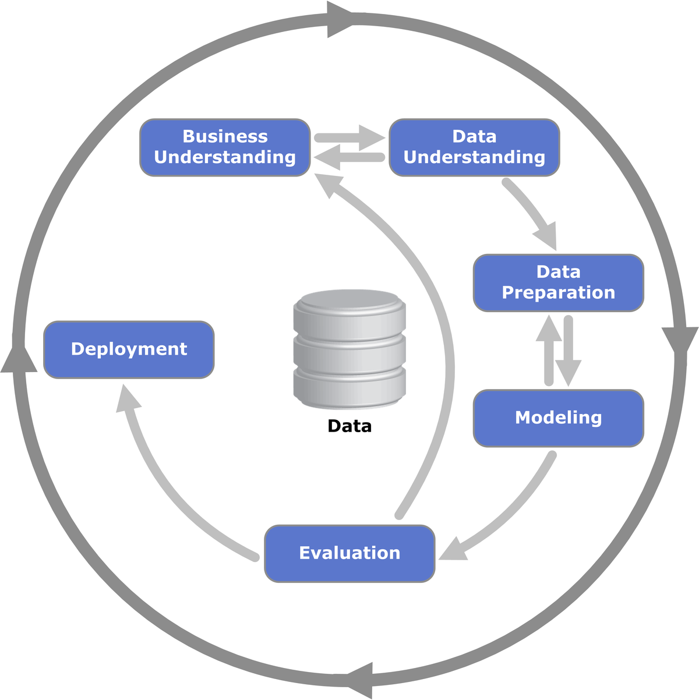
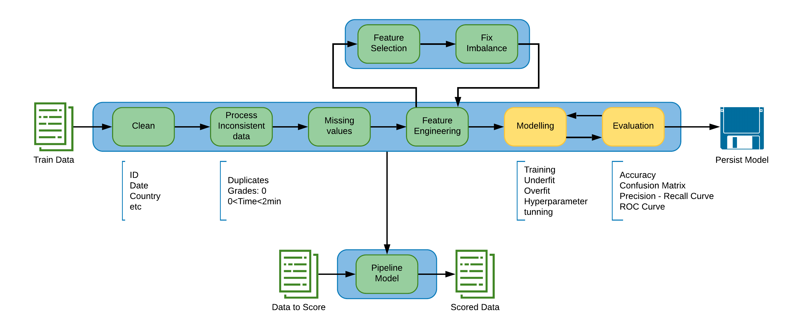

# Big Five Personality Test <!-- omit in toc -->
# Table of contents <!-- omit in toc -->
- [Pipeline](#pipeline)
- [Data](#data)
- [Modelling](#modelling)
- [References](#references)
The following project developed a solution to grade Big Five Personality Tests. The project was developed according to CRISP-DM phases, as follows:

<i>Figure 1. CRISP-DM Methodology. Source: [1-2].</i>

The `target variable` corresponds to the trait with max value of the test. Further information about the traits can be found below.  

|         Trait          | Class | Description                                                                                                                            |
| :--------------------: | :---: | :------------------------------------------------------------------------------------------------------------------------------------- |
|      Extroversion      |   E   | **High scores:** People who tend to be social **Low scores:** People who prefer to work alone in projects                           |
|     Agreeableness      |   A   | **High scores:** Politically correct people **Low Scores:** Direct people                                                           |
|   Conscientiousness    |   C   | **High Scores:** People who tend to follow the rules and prefer order **Low Scores:** People who tend to be disorganized            |
|      Neuroticism       |   N   | How emotional the person can be                                                                                                        |
| Openness to Experience |   O   | **High Scores:** People who tend to “dream with their eyes open” **Low Scores:** People who tend to “have their feet on the ground” |

# Pipeline
The following pipeline summarizes the steps and procedures which have been taken into account during training / validation and testing.

<i>Figure 2. Pipeline. </i>

# Data
The exploratory Data Analysis allowed us to conclude that there were a imbalance in `target variable`. Then two approaches to go over this situation were followed:

- UnderSampling
- Oversampling

Data can be downloaded [here](https://drive.google.com/file/d/1PWuVxvaP_L5dkPZhgQtoOv9FIQhUEXgd/view?usp=sharing).
# Modelling
The project at hand corresponds to a problem of multiclass classification. The following classifiers were trained and validated:
- Logistic Regression Classifier
- Decision Tree Classifier
- Random Forest Classifier
- Naive Bayes Classifier

# References
    [1]	M. F. Hornick, E. Marcadé, and S. Venkayala, “Chapter 3 - Data Mining Process,” in The Morgan Kaufmann Series in Data Management Systems, M. F. Hornick, E. Marcadé, and S. B. T.-J. D. M. Venkayala, Eds. Burlington: Morgan Kaufmann, 2007, pp. 51–83.
    [2]	“File:CRISP-DM Process Diagram.png - Wikimedia Commons.” .
    [3]	B. Tunguz, L. Petar, and M. Akdag, “Big Five Personality Test | 1M Answers to 50 personality items, and technical information.” [Online]. Available: https://www.kaggle.com/tunguz/big-five-personality-test. [Accessed: 20-Jun-2020].